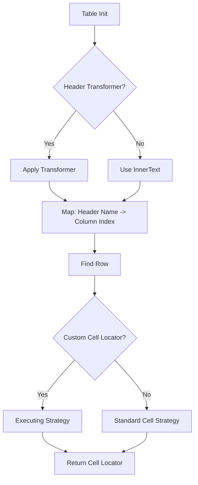

<!-- Last Reviewed: 02/06/2026 
Needs Fix for Mermaid Diagrams
-->
# Custom Resolution Logic

For complex scenarios where the standard `header -> column index -> cell` mapping isn't enough.

## The Problem

Standard tables align headers and cells perfectly:
- Header 1 covers Column 1
- Cell 1 is in Column 1

Complex tables (grids, virtual lists, accessibility structures) might not:
- Headers might be in a separate `<div>` structure
- Cells might use `aria-colindex` or `data-field` instead of DOM order
- Duplicate headers might exist (e.g., "Actions" column at start and end)

## Logic Flow



## Header Transformers

Customize how column names are derived from header elements.

```typescript
const table = useTable(loc, {
    headerTransformer: (element, index) => {
        // e.g., Headers have a hidden <span> with the real ID
        const realName = element.querySelector('.col-id')?.innerText;
        return realName || element.innerText;
    }
});
```

## Custom Cell Locators

Override exactly how a cell is found for a given row and column.

```typescript
strategies: {
    getCellLocator: ({ row, columnName, columnIndex }) => {
        // Option 1: Find by Attribute (Best for data grids)
        return row.locator(`[data-field="${columnName}"]`);
        
        // Option 2: Find by ARIA index
        const colIdx = columnIndex + 1; // 1-based aria index
        return row.locator(`[role="gridcell"][aria-colindex="${colIdx}"]`);
        
        // Option 3: Find by Class
        return row.locator(`.col-${columnName.toLowerCase()}`);
    }
}
```

## Duplicate Headers

If your table has duplicate column names (e.g., two "Status" columns), the library will warn you. To fix this, use a `headerTransformer` to make them unique:

```typescript
headerTransformer: (text, index) => {
    if (text === 'Status') {
        return index === 0 ? 'Status (Primary)' : 'Status (Secondary)';
    }
    return text;
}
```

Now you can target them explicitly:
```typescript
row.getCell('Status (Secondary)')
```
