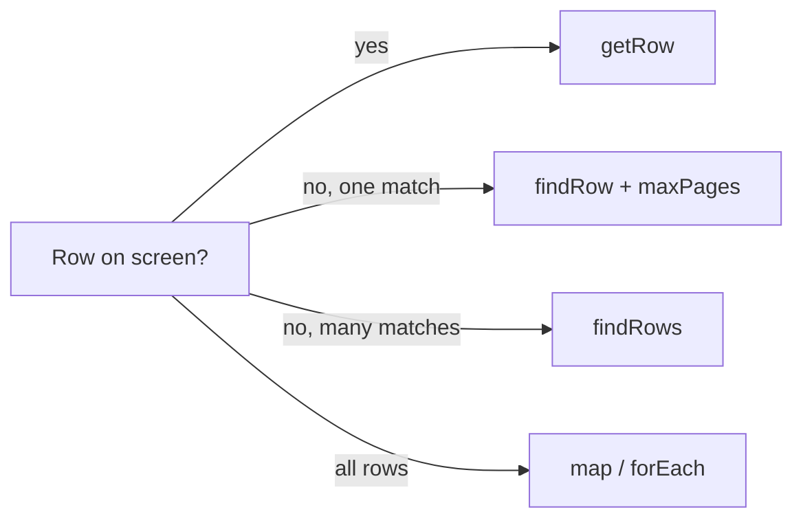

# Lab (draft visuals) <LabFeedbackMark slug="intro" label="Page intro" />

**Local preview:** run `npm run docs:dev`, then open **Lab** in the top nav or go to [`/lab/`](/lab/) (with the site base, e.g. `http://localhost:5173/playwright-smart-table/lab/`).  
**Published site:** draft pages under `docs/lab` are **not** shipped; `npm run docs:build` (used in CI) excludes them. To build the full site including Lab, use `npm run docs:build:all`.

Interactive rough drafts for docs and UX. Polished teaching pages live under [Concepts](/concepts/table-anatomy).

## Method walkthrough <LabFeedbackMark slug="method-walkthrough" label="Method walkthrough widget" />

<LabMethodWalkthrough />

**Reference flow:** <LabFeedbackMark slug="method-mermaid" label="Mermaid reference diagram" />

## Strategy picker <LabFeedbackMark slug="strategy-picker" label="Strategy picker" />

<LabStrategyPicker />

## Debug playback (sample logs) <LabFeedbackMark slug="debug-playback" label="Debug playback" />

<LabDebugPlayback />

## Live query builder <LabFeedbackMark slug="query-builder" label="Live query builder" />

Edit the `getRow` call directly — add and remove key/value pairs, watch the table respond in real time. Misspell a column name to see the guided error with fuzzy suggestions, right inline.

<LabQueryBuilder />

## The column shuffle test <LabFeedbackMark slug="before-after" label="The column shuffle test" />

Pick a question. Shuffle the columns. Brittle index-based code reads from the wrong cell — Smart Table stays tied to header names regardless of column order.

<LabBeforeAfterV2 />

## Init → getRow (debugger-style) <LabFeedbackMark slug="init-get-row-debug" label="Init getRow debugger" />

<LabInitGetRowDebug />

## findRow + pagination + checkbox (debugger-style) <LabFeedbackMark slug="find-row-pagination-debug" label="findRow pagination debugger" />

<LabFindRowPaginationDebug />

## Failure states <LabFeedbackMark slug="failure-states" label="Failure states" />

<LabFailureStates />

## Table type gallery <LabFeedbackMark slug="table-gallery" label="Table type gallery" />

<LabTableTypeGallery />

## Existing interactives <LabFeedbackMark slug="links-concepts" label="Links to Concepts pages" />

- [Table Anatomy](/concepts/table-anatomy) — selector scoping.
- [Header Mapping](/concepts/header-mapping) — `__col_*` + `headerTransformer`.
- [Pagination Strategies](/concepts/pagination-strategies) — pager shapes.
